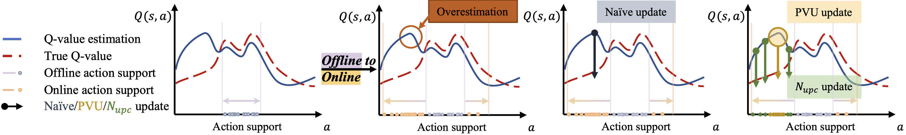
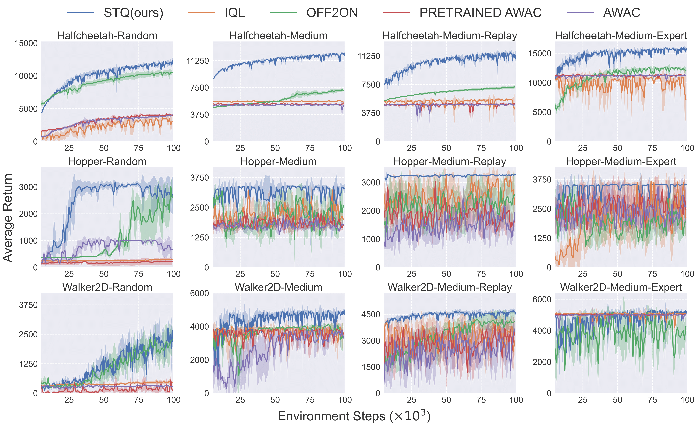

# SO2: A Perspective of Q-value Estimation on Offline-to-Online Reinforcement Learning

**SO2 offers a fresh perspective on offline-to-online reinforcement learning through Q-value estimation and presents a straightforward yet effective implementation.**



> [**SO2: A Perspective of Q-value Estimation on Offline-to-Online Reinforcement Learning**](https://arxiv.org/abs/2312.07685)               
> Yinmin Zhang, Jie Liu, Chuming Li, Yazhe Niu, Yaodong Yang, Yu Liu, Wanli Ouyang
> *[arXiv:2312.07685](https://arxiv.org/abs/2312.07685)* 

## Updates

- (12/2024) Code has been released!

## Installation

### All scripts

The scripts from installation to execution are all here👏.

```
# install MuJoCo for Linux
mkdir -p ~/.mujoco/mujoco210 
wget https://mujoco.org/download/mujoco210-macos-x86_64.tar.gz -O mujoco210-macos-x86_64.tar.gz
tar -xf mujoco210-linux-x86_64.tar.gz -C ~/.mujoco/mujoco210 
pip install -U 'mujoco-py<2.2,>=2.1'

# install D4RL
pip install git+https://github.com/Farama-Foundation/d4rl@master#egg=d4rl

# install SO2
conda create --name SO2 python=3.7 -y
conda activate SO2
git clone https://github.com/opendilab/SO2@code
pip install -e SO2

# run d4rl experiment
# Note download checkpoints and unzip into ckpt folder
python3 -u train.py 
```

### Install environment

#### Install MuJoCo and `mujoco-py`

1. Download the MuJoCo version 2.1 binaries for
   [Linux](https://mujoco.org/download/mujoco210-linux-x86_64.tar.gz) or
   [OSX](https://mujoco.org/download/mujoco210-macos-x86_64.tar.gz).
1. Extract the downloaded `mujoco210` directory into `~/.mujoco/mujoco210`.

To include `mujoco-py` in your own package, add it to your requirements like so:

```
pip install -U 'mujoco-py<2.2,>=2.1'
```

#### Install D4RL

D4RL can be installed by cloning the repository as follows:
```
git clone https://github.com/Farama-Foundation/d4rl.git
cd d4rl
pip install -e .
```

Or, alternatively:
```
pip install git+https://github.com/Farama-Foundation/d4rl@master#egg=d4rl
```

#### Install SO2

```
git clone https://github.com/opendilab/SO2@code
pip install -e SO2
```

## Getting Started

### MuJoco

```
python3 -u so2/d4rl_main.py
```

## Results
### MuJoCo


## License

This project is released under the Apache 2.0 license. See [LICENSE](LICENSE) for details.

## Citing SO2
If you use SO2 in your research or wish to refer to the baseline results published here, please use the following BibTeX entry.

```BibTeX
@inproceedings{zhang2023perspective,
  title={A Perspective of Q-value Estimation on Offline-to-Online Reinforcement Learning},
  author={Zhang, Yinmin and Liu, Jie and Li, Chuming and Niu, Yazhe and Yang, Yaodong and Liu, Yu and Ouyang, Wanli},
  booktitle={Proceedings of the AAAI Conference on Artificial Intelligence},
  year={2024}
}
```
